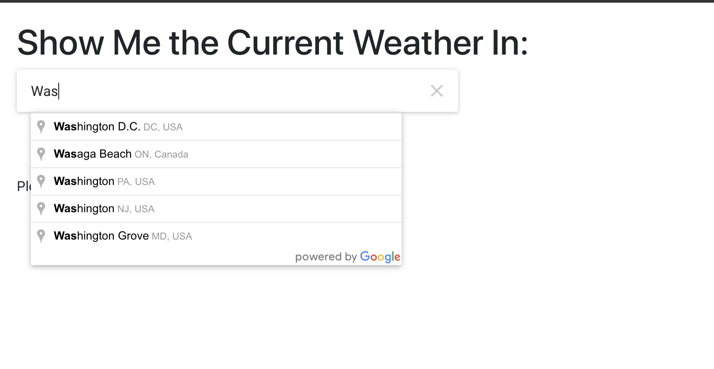
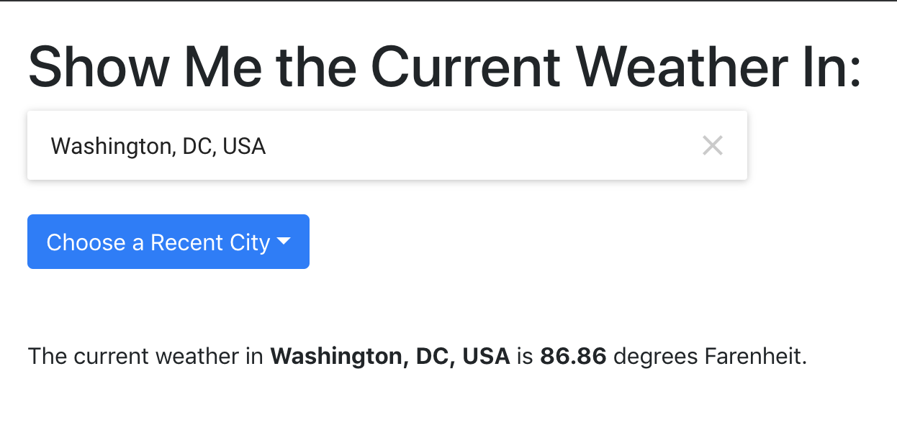
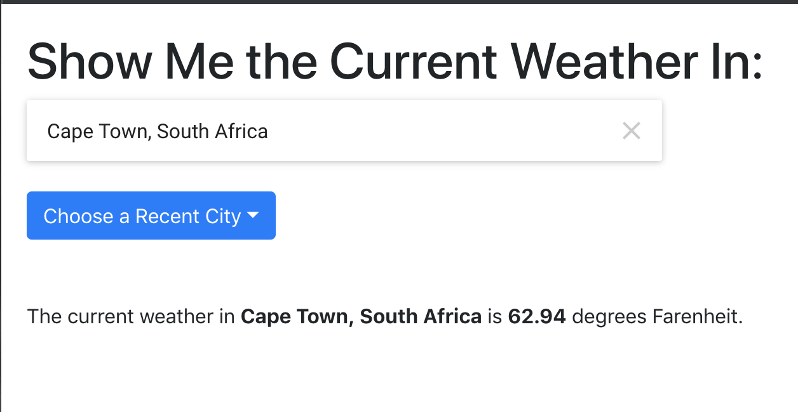
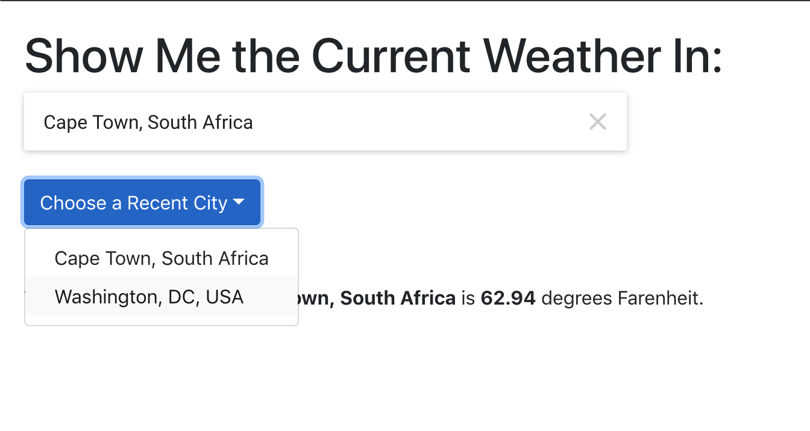

# Current Weather
Autosuggest Cities | Weather in the City |  Weather in Another City | Selecting from Previous Cities
--- | --- | --- | --- 
 |  |  | 

This project was for the Full Stack Developer bootcamp I did and was for a lesson on fetching data.

## The Assignment

> * Create a React app that will display the weather in a city of the user’s choice. The user should be able to enter or select the name of the city that they
would like to see the weather for.
>
> * Get the weather by using the OpenWeatherMap API: https://openweathermap.org/current.

## The Solution
I was able to tie my React application with the OpenWeatherMap API. I also used the Google Maps API in order to autosuggest cities.

I have the code hosted for demo at Heroku. It may be a little slow to spin up but you can [see it here](https://dh4u-bootcamp-current-weather.herokuapp.com/).

## Running the Code Locally

[Clone / Download](https://github.com/dh4u/bootcamp-react-resume.git) the project to your computer.

### Get API Keys

You will need to get an API keys for [Google Maps](https://developers.google.com/maps/documentation/javascript/get-api-key) and [OpenWeatherMap](https://home.openweathermap.org/users/sign_up).
  
Next, save the .env file in the root folder as .env.local (the .env file may be hidden). Edit .env.local and add your API keys. Finally, make sure .env.local is in your gitIgnore file so you don't publish your API keys! 

### Start the code
Open command prompt / terminal for the project folder and then you can run:

#### `npm install`

This will install the node dependencies.

#### `npm start`

Runs the app in the development mode. 
Open [http://localhost:3000](http://localhost:3000) to view it in the browser.
 
 

***
###### This project was bootstrapped with [Create React App](https://github.com/facebook/create-react-app).

###### Autosuggest functionality was based on this [using Google Maps autosuggest](https://medium.com/@hamza.qaisrani.hq/using-the-google-maps-places-autocomplete-javascript-api-in-a-react-project-5742bab4abc9) tutorial.
